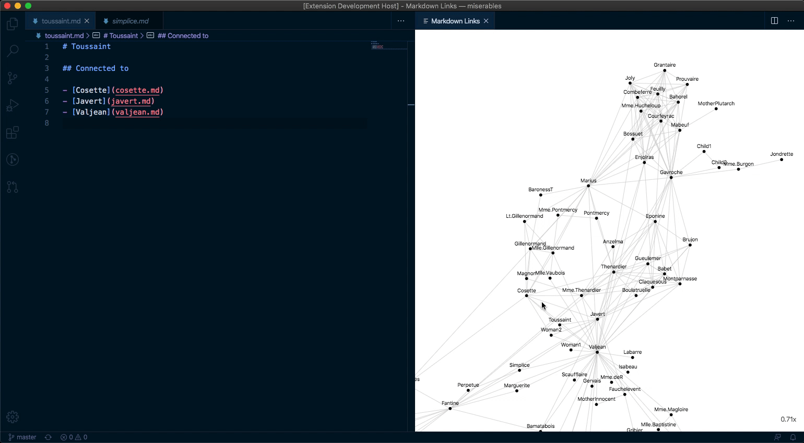

# Markdown Links

Adds command `Show Graph` that displays a graph of local links between markdown files in the current working directory.



## Workflow

Recommended workflow is either keeping the graph open and using it as an alternative to the explorer sidebar or checking the it from time to time.

The graph refreshes automatically every time you:

- Update a markdown title of the file.
- Change links to other files.
- Create a new file and add give it a title.
- Remove a file.

## Concepts

- Title is always the first markdown heading of depth 1, i.e. `# Title`.
- Files which do not have a title do not appear in the graph.
- Files can link to other files using local Markdown links or ID-based links.
- The graph is not directed. It doesn't show which file has the link and which one is linked.
- Directory structure is not relevant for the graph. All that matters is the mutual links between files.

### Local Markdown links

Regular markdown links syntax with a relative or absolute file. For example: `[link name](./other-file-in-this-dir.md)`.

### ID-based links

A file can be given an ID. The ID is a first string matching a configured pattern (see [Settings](#settings)) found in the file.

File having an ID can be linked using double-bracketed 'wiki-style' links. For example:

```md
<!-- file1.md -->

# This is a file having an id

This is its id: 20200522225822
```

```md
<!-- file2.md -->

# This is a file linking to another

See the other file: [[20200522225822]]
```

This feature is heavily inspired by [Zettlr](https://github.com/Zettlr/Zettlr), therefore its [documentation](https://docs.zettlr.com/en/reference/settings/#the-id-regex) may give useful background.

#### Using title as the ID

By setting the ID regexp setting to `(?<=^# ).+$` all titles (level 1 # headings) will be detected as IDs. This allows you to do the following:

```md
<!-- file1.md -->

# This file just has a title

And some content.
```

```md
<!-- file2.md -->

# This is a file linking to another

See the other file: [[This file just has a title]]
```

## Examples

The extension provides some examples to better explain the concepts above.

### Basic file

```md
# Title

Link can be present in [text](first.md) or on a special list.

## Linked

- [Second](./2.md)

Named reference can also be used, like this: [Reference].

[reference]: ref.md
```

### Functionality

Explore available functions in [examples/functionality](examples/functionality).

### Wiki

You can can the previously mentioned wiki-style example in [examples/wiki-links](examples/wiki-links).

### Les Miserables

If you want to see behavior of a bit bigger graph, check [examples/miserables](examples/miserables). Remember to run `node miserablelise.js` to generate files.

## Settings

This extension contributes the following settings:

### `markdown-links.showColumn`

Controls in which column should the graph appear. Refer to [Column values](####column-values). Defaults to `beside`.

### `markdown-links.openColumn`

Controls in which column should clicked files open. Refer to [Column values](###c#olumn-values). Defaults to `one`.

#### Column values

- `active` – in the currently focused column.
- `beside` – other than the current.
- `one` (**default**), `two`, `three`, `four`, `five`, `six`, `seven`, `eight`, `nine` – respective editor columns.

### `markdown-links.fileIdRegexp`

A [regular expression](https://developer.mozilla.org/en-US/docs/Web/JavaScript/Guide/Regular_Expressions) used to find the file ID for use in wiki-style links.

## Roadmap

This is early development version. I am currently considering:

- [x] Main `Show Graph` command.
- [x] Setting for choosing column for opening files.
- [ ] Automated tests.
- [ ] Dark theme support (+ auto detecting system's dark/light mode).
- [ ] Zoom controls (`+` / `-` / `reset`).
- [ ] Handling external URLs.
- [ ] Ignoring files or directories.
- [ ] Some directory controls within the graph view (adding, removing files).
- [ ] Configurable simulation.
- [ ] Optional display of edge directions.
- [ ] Better examples.
- [ ] Optional autostart.

## Changelog

Refer to the [CHANGELOG.md](CHANGELOG.md) file.

## Contributing

You are very welcome to open an issue or a pull request with changes.

If it is your first time with vscode extension, make sure to checkout [Official Guides](https://code.visualstudio.com/api/get-started/your-first-extension).
